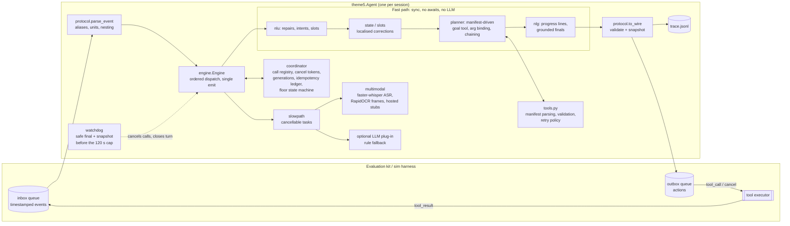

<!-- README.md -->
# Theme 05: Interruptible Real-Time Agent

Samsung PRISM GenAI Hackathon 2026, Theme 05. A voice/text/vision assistant that keeps working while the user interrupts, corrects themselves, or changes their mind mid-task, without losing state, repeating side effects, or going silent.

## Submission

| | |
|---|---|
| Hackathon | Samsung PRISM GenAI Hackathon 2026 (3rd edition) |
| Theme | 05, Interruptible Real-Time Agents |
| Team | Santa Claude (`MSRIT_SantaClaude`) |
| College | MSRIT |
| Members | Kartikey Pandey, Primary Data Analyst |
| Release tag | [`PRISM_GENAI_HACKATHON_Y2026`](https://github.com/pandeykartik658-del/samsung-hackathon/releases/tag/PRISM_GENAI_HACKATHON_Y2026) (the tagged commit is the one judged) |
| Presentation | [`submission/MSRIT_SantaClaude.pptx`](submission/MSRIT_SantaClaude.pptx) (PDF copy: [`submission/MSRIT_SantaClaude.pdf`](submission/MSRIT_SantaClaude.pdf)) |
| Demo video (in repo) | [`submission/Theme05_Demo.mp4`](submission/Theme05_Demo.mp4), 4:30, 1080p, voice narration with burned-in captions ([`.srt`](submission/Theme05_Demo_captions.srt)) |
| Demo video (YouTube/Drive) | The video is committed in this repo (row above); the YouTube/Drive copy is linked on the Google Form submission |
| Video script | [`submission/DEMO_VIDEO_SCRIPT.md`](submission/DEMO_VIDEO_SCRIPT.md); the trace pages it shows are in [`submission/viewer/`](submission/viewer/) (open in a browser, press Play) |
| Docker | [`Dockerfile`](Dockerfile), built and tested on every push by [`.github/workflows/docker.yml`](.github/workflows/docker.yml) |
| Requirements | [`requirements.txt`](requirements.txt) (pinned runtime), [`requirements-dev.txt`](requirements-dev.txt) (tests) |

Everything the submission references (code, requirements, Docker files, deck, video, docs) is in the tagged commit. The video is 9 MB, so it is committed directly; the external link is only a convenience for the Google Form.

### Quick start

Requirements: Python 3.10, 3.11 or 3.12 and `make` (Linux/macOS), or Docker. No GPU, no API keys, no network at run time.

```bash
git clone --branch PRISM_GENAI_HACKATHON_Y2026 https://github.com/pandeykartik658-del/samsung-hackathon.git
cd samsung-hackathon

# Option A: local virtualenv
make venv install        # creates .venv and installs requirements.txt + requirements-dev.txt
make models              # optional: Whisper base.en weights into ./models (needs Hugging Face access)
make test                # full pytest suite
bash run_demo.sh         # 9 scenarios + 60-scenario bench + trace viewer, output in runs/demo/

# Option B: Docker (everything baked in, runs offline)
docker build -t theme5 .
docker run --rm theme5                                # demo
docker run --rm theme5 python -m pytest -q tests viewer   # test suite
docker run --rm -i theme5 python -m theme5 serve      # JSONL events on stdin, actions on stdout
```

Without `make`: `python3 -m venv .venv && . .venv/bin/activate && pip install -r requirements.txt -r requirements-dev.txt`, then `python -m pytest -q tests viewer` and `bash run_demo.sh`.

### Results

All numbers come from our own simulator and rubric replica (`bench/scorer.py`), because the official evaluation kit is not released yet. The Docker CI run on every push reproduces them.

| Suite | Score |
|---|---|
| 60-scenario adversarial bench, kit transcripts and labels provided | 100.0 |
| Same bench, raw media only (`--strip-oracle`, Whisper + OCR do the perception) | 87.4 (was 78.2 before perception was switched on) |
| Visual scenarios on raw frames | 12 of 12 at 100 |
| 9 public-style scenarios on raw media | 91.3, 7 of 9 pass |

Audio is the weak spot on raw media: most misses are flight codes and passenger names that Whisper mishears. Every miss ends in a clarifying question or a partial answer, and no wrong or duplicate booking was made in any run.

## Problem

A real-time assistant receives a stream of timestamped events (text chunks, WAV clips, PNG frames, interruptions, asynchronous tool results) and must answer on a second stream with spoken fillers, non-blocking tool calls, cancellations, clarifying questions and final responses that carry a State Snapshot (intent + slots). The hard parts are the ones a turn-based chatbot never meets:

- a correction arrives while the search it invalidates is still running;
- a result comes back for a call the agent has already cancelled;
- a state-modifying tool (a booking) must never run twice, even across retries and repairs;
- a scenario hands the agent a tool it has never seen;
- audio and camera frames need perception that is slow compared with the conversation.

Scoring (guide §5): Task Completion 40, Interruption Recovery 35, Latency 15, Safety & Protocol 10, times a 0.8-1.2 quality multiplier, with audio and visual scenarios weighted 1.5x. Constraints (guide §6): Python 3.10-3.12, 120 s wall clock per scenario, 300 s warm-up.

## Architecture



Every kit-specific spelling lives in `theme5/protocol.py` (and its companion `theme5/protocol_media.py`). Everything else uses internal names, so plugging in the official kit is a one-file change (see [Evaluation adapter](#evaluation-adapter)). Deeper design notes: `docs/ARCHITECTURE.md` (concurrency, floor state machine, idempotency, an interruption end to end), `docs/SPEC.md` (requirements R01-R56 and kit unknowns U01-U26), `docs/MULTIMODAL.md`, `docs/PLAN.md`.

## Run it in 3 commands

```bash
git clone <this repo> theme5 && cd theme5
make venv install          # Python 3.10-3.12; `make install-core` skips the ~650 MB perception extras
bash run_demo.sh           # 9 public-style scenarios, 60-scenario bench, trace viewer
```

Or with Docker (offline at run time, Whisper weights baked in at build):

```bash
docker build -t theme5 .
docker run --rm theme5                                   # demo
docker run --rm -i theme5 python -m theme5 serve         # JSONL events on stdin, actions on stdout
```

The build needs PyPI and Hugging Face access and fails loudly if the Whisper download fails. Without Hugging Face, either run `make models` somewhere that has it and copy `models/` into the build context, or build with `--build-arg FETCH_MODELS=0` (audio then relies on kit transcripts and clarifying questions). `--build-arg WHISPER_MODEL=tiny.en` trades accuracy for a 75 MB model. The image has no apt layer: it swaps RapidOCR's OpenCV for the headless wheel of the same version, which needs no system libraries. Image size is about 1.2 GB before weights.

`run_demo.sh` writes everything under `runs/demo/`: the scenario report, `bench/REPORT.md` (per-scenario rubric table plus the 5 worst failures with trace excerpts), and `trace_viewer.html` with a real trace embedded. Open the viewer in a browser and press Play to replay the virtual clock; any other trace loads through "Open JSONL".

Other entry points:

| Command | What it does |
|---|---|
| `make scenarios` | `python -m sim.run scenarios --report`: 9 scenarios mirroring the public ones, pass/fail checks + rubric |
| `make bench` | `python -m bench.run_suite bench/scenarios60 ...`: 60 adversarial scenarios (30 text, 18 audio, 12 visual) |
| `python -m sim.run scenarios --strip-oracle` | same, with kit-provided transcripts/labels removed so perception must do the work |
| `python -m bench.real_media bench/scenarios60 /tmp/real60` | copy of the bench with perceivable media: speech from espeak-ng, frames with printed device name, model and display code; run it with `--strip-oracle` to score Whisper + OCR (CI does this on every push) |
| `python -m bench.profile_suite bench/scenarios60 --out bench/runs/profile` | time to first spoken action, blocking loop callbacks, memory growth, time vs the 120 s cap |
| `python -m bench.scorer --assumptions` | every assumption the rubric replica makes (A01-A50) |
| `make serve` | JSONL agent on stdin/stdout |
| `make models` | download Whisper weights into `./models` (the Docker build does this itself) |
| `make help` | all targets |

## Tests

```bash
make test                  # = python -m pytest -q tests viewer
```

About 470 tests: protocol parsing, engine and coordinator (stale results dropped, late results after cancel, duplicate bookings blocked, a snapshot on every final), adversarial interruption timing through the virtual-clock harness, tools (three manifests the code has never seen), multimodal backends with timeouts and cancellation, slots, fast path, protocol fuzzing (malformed events, missing fields, unknown types, out-of-order timestamps) and the global watchdog (`tests/test_hardening.py`), the scorer and the scenario generator. Every module ships with tests.

Opt-in tests skip cleanly when their dependency is missing:
- real Whisper weights: `THEME5_TEST_WHISPER=1 python -m pytest tests/test_multimodal.py` (in Docker: `docker run --rm -e THEME5_TEST_WHISPER=1 theme5 python -m pytest -q tests/test_multimodal.py`);
- browser checks of the trace viewer: `pip install playwright` with a Chromium available.

Verified on a fresh copy of this tree in clean virtualenvs on Python 3.10, 3.11 and 3.12 (full `requirements.txt` and stdlib core only), and inside the Docker image with networking disabled.

## Repository layout

```
theme5/            the agent package (entry point: theme5.agent:Agent)
  protocol.py        ONLY place that knows kit spellings; every guess labelled ASSUMPTION + U-number
  protocol_media.py  media field access and perception time budgets (companion to protocol.py)
  engine.py          event loop, single emit(), call lifecycle
  coordinator.py     call registry, cancel tokens, generations, idempotency ledger, floor
  agent.py           policy: parse, update state, re-plan, choose what to say
  nlu.py planner.py nlg.py state.py slots.py fastpath.py tools.py
  watchdog.py        closes a hanging turn with a safe final_response before the 120 s cap
  warmup.py          one throwaway mini-session at setup so the first real turn is warm
  slowpath.py multimodal.py plugins.py clock.py events.py trace.py cli.py
sim/               virtual-clock harness mirroring guide §4: mock tools, faults, JSONL traces
scenarios/         9 scenarios mirroring the public set (+ WAV/PNG assets)
bench/             rubric replica (scorer.py), 60-scenario generator, suite runner, scenarios60/
viewer/            single-file HTML trace timeline for the demo and jury walkthrough
tests/             pytest suite
docs/              SPEC, ARCHITECTURE, PLAN, MULTIMODAL, SLOTS_INTEGRATION
scripts/           fetch_models.py (Whisper download + offline smoke load)
models/            Whisper weights (git-ignored; filled by `make models` or the Docker build)
submission/        jury deck MSRIT_SantaClaude (.pptx + .pdf), demo video (.mp4 + .srt), video script, demo trace pages
.github/workflows/ docker.yml: build the image, real-weight Whisper test, full tests, demo on every push
```

## Evaluation adapter

The official kit is not released. The guide fixes the shape of the contract (two async queues, the event and action kinds, read-only vs state-modifying tools, a State Snapshot on final responses) but no field names, event names, units or transport. Every such guess is an ASSUMPTION tagged with its unknown number from `docs/SPEC.md` and isolated in `theme5/protocol.py` + `theme5/protocol_media.py`. No other agent module reads a raw kit field.

### 1. Connect the transport (U01, U02, U23)

Pick whichever the kit uses; both already work.

- **In process** (asyncio queues):
  ```python
  from theme5 import Agent
  agent = Agent()                 # one instance per session (U26); no module-level state
  await agent.setup()             # warm-up hook, loads ASR/OCR models (300 s budget)
  await agent.run(inbox, outbox)  # inbox: dicts or JSON strings; returns on end event or None
  ```
  If the kit drives a virtual clock, pass it: `Agent(clock=...)` (any zero-argument callable returning milliseconds, e.g. `theme5.clock.VirtualClock`). Otherwise the agent stamps actions on the event clock (latest event `t` + local elapsed), never on wall time.
- **Subprocess**: `python -m theme5 serve` reads one JSON event per line on stdin and writes one JSON action per line on stdout.

If the kit expects a different module path or function name, add a three-line shim that imports `theme5.agent.Agent`; do not move code.

### 2. Map the kit's spellings in `protocol.py`

Record one real session from the kit (or read its schema), then edit only these names:

| Kit fact | Where in `theme5/protocol.py` | Default assumed now |
|---|---|---|
| Event type names (U03) | `_EVENT_ALIASES` (keys are lower-cased with `_`/`-` removed) | many aliases: `text_chunk`, `interrupt`, `tool_result`, `audio_clip`, `video_frame`, `session_end`, ... |
| Discriminator key and nesting (U04) | `parse_event` (`type`/`event`/`kind`/`event_type`; `payload`/`data` flattened) | `type`, flat |
| Timestamp key and unit (U05) | `_TS_KEYS`, `TS_UNIT`, `to_ms`, `WireFormat` (echoes the kit's key and unit on output) | `t`, milliseconds; ISO and epoch accepted |
| Text chunks, end of turn (U07) | `_TEXT_KEYS`, `is_end_of_turn`, `is_cumulative`, `EOT_TOKENS` | incremental chunks with a boolean flag |
| Interruption (U08, U09) | `EV_INTERRUPT` aliases, `ACK_ON_INTERRUPT` | explicit event, text optional |
| Tool manifest (U11) | `_SCHEMA_KEYS`, `_READ_BOOL_KEYS`, `_WRITE_BOOL_KEYS`, `_KIND_KEYS`, `_READ_WORDS`, `_WRITE_WORDS`, `_IDEMPOTENT_KEYS`, `_TYPE_ALIASES`, `parse_tool_def` | OpenAI/JSON-Schema/MCP shapes; unmarked tools are state-modifying |
| Tool results and faults (U14) | `parse_tool_result`, `_RETRYABLE_CODES`, `TOOL_TIMEOUT_MS`, `MAX_RETRIES` | `call_id` + `result` or `error`; kit times calls itself |
| Outbound action names (U18) | `ACT_*`, `WIRE_TYPES` (internal type -> kit type) | `speak`, `tool_call`, `cancel`, `clarify`, `final_response` |
| Tool call fields (U12, U13) | `WIRE_FIELDS`, `EMIT_CALL_META`, `IdGen` | `{"call_id", "name", "arguments"}`, agent-generated ids |
| State Snapshot (U16, U17) | `snapshot_payload`, `SNAPSHOT_INTENT`, `SNAPSHOT_SLOTS` | `{"intent": <goal tool>, "slots": {<tool param names>}}` on every action |
| Output validation (U24) | `validate_action`, `to_wire` | every action validated before it leaves |
| Session end (U23) | `EV_END` aliases, `CANCEL_PENDING_ON_END` | explicit event or inbox `None`; in-flight calls left alone |
| Audio / frame payloads (U19, U20) | `theme5/protocol_media.py`: `_PATH_KEYS`, `_B64_KEYS`, `_SR_KEYS`, env `THEME5_MEDIA_ROOT`; budgets `AUDIO_TIMEOUT_S`, `FRAME_TIMEOUT_S` | file path or base64; kit transcript/labels used first when present, otherwise faster-whisper / RapidOCR (`THEME5_PERCEPTION=hints` turns the models off) |

### 3. Point the local harness at the same format

`sim/wire.py` holds the harness's copy of the field names. Align it with the kit (or pass `python -m sim.run --codec mymodule` with `decode_event`/`encode_action`), so `make scenarios` and `make bench` keep exercising the real format.

### 4. Verify

```bash
python -m pytest -q tests/test_protocol.py tests/test_engine.py   # parser + emit contract
make test                                                           # everything
python -m sim.run <kit public scenarios> --report                   # or the kit's own runner
```

Check that the kit's Safety & Protocol score is full on the 9 public scenarios before looking at anything else: a protocol mismatch costs points in every category. Then record per-scenario scores here.

## Design decisions and trade-offs

| Decision | Why | Cost |
|---|---|---|
| No LLM on the fast path; rules for NLU, planning and wording | Deterministic, microsecond latency, no network risk inside the 120 s cap; the first substantive action goes out on the same event tick | Narrower language coverage than an LLM; mitigated by manifest-driven planning and an optional LLM plug-in with a 2 s budget and rule fallback |
| Cancel before speaking | On a correction, superseded calls are cancelled in the same handler, before any speech (grace period U09 may be ~0 ms) | none |
| Diff, don't flush | In-flight calls whose arguments survive a correction are kept (promoted to the new generation); only invalid ones are cancelled | More bookkeeping (generation counter, `_reconcile`) |
| Generation counters + stale-result classification | A late result (`late_after_cancel`, `stale_generation`, `duplicate_result`, `unknown_call`) is logged and never reaches the planner or speech | none |
| Idempotency ledger keyed on tool + canonical args | A state-modifying call is never sent twice; writes retry only on a retryable error; after a commit, changes go through a modify tool or are refused | A genuine second identical booking needs a different phrasing (acceptable for this rubric) |
| Unmarked tools are state-modifying | The guide penalises duplicate side effects; treating an unknown write as a read is the expensive mistake | Unmarked read tools are not retried or speculated |
| Speculative read-only calls on partial turns | Starts searches before end of turn when slots suffice and the text is not mid-repair; adopted or cancelled at end of turn | Occasional cancelled speculative calls in traces (never writes) |
| Everything on the event/virtual clock | Reproducible traces; timeouts run on virtual time in the harness | Needs the kit's clock semantics (U06) |
| Offline perception: faster-whisper `base.en` int8 + RapidOCR | Best CPU accuracy per second without PyTorch; OCR reads display codes and model labels, which is what manual lookups need | ~650 MB installed + 145 MB weights. PyTorch Whisper or a VLM would be 1.5-4 GB and slow on CPU |
| Global watchdog at 110 s (`protocol.WATCHDOG_AT_S`) | If a turn is still open near the 120 s cap, cancel in-flight work and emit one honest final response with a valid snapshot instead of timing out with nothing | A very slow scenario ends with a partial answer |
| Ask, don't guess | Low ASR confidence, dark/blank/ambiguous frames and missing required parameters produce one targeted clarifying question | One extra turn when a guess would have been right |
| Own harness + rubric replica | The kit is unreleased; `sim/` and `bench/` let every change be scored on 69 scenarios in about a second | The replica is our reading of the guide (assumptions A01-A50), not the official scorer |

## Limitations

- **Unreleased kit.** All 26 wire-format unknowns are guesses. The adapter confines the fix to one file, but until the kit ships the protocol score is unverified.
- **Self-graded numbers.** The 60-scenario bench scores 100.0 against our own scorer on scenarios we generated. Hidden scenarios will be harder; treat the number as a regression guard, not a forecast.
- **Placeholder media.** WAV/PNG files in `scenarios/` and `bench/` are tone bursts and coloured boxes, so `--strip-oracle` on them scores the fallback (clarifying questions), not perception. `bench/real_media.py` rebuilds the suite with synthetic speech and text-bearing frames for that; real kit audio (accents, noise) and photos will be harder, and frames with no printed text still need the kit's labels or a vision model.
- **Whisper verified only in CI.** Hugging Face is unreachable from the dev container, so real-weight Whisper runs in the Docker image on GitHub Actions (`.github/workflows/docker.yml`, test `test_faster_whisper_real_model`) rather than locally.
- **Sibling modules not yet wired into `agent.py`:** `fastpath.py` and `slots.py` are implemented and tested but the agent still uses its built-in equivalents (`docs/PLAN.md`, next steps). Perception is wired: the agent defaults to `multimodal.HybridPerception` (kit hints first, then Whisper/OCR).
- **English only.** NLU rules, number and date parsing assume English.

## Future work (worklet)

**Title:** Kit-conformant, learning-assisted interruptible agent for on-device assistants.

**Problem:** Rule-based understanding is fast and safe but brittle to phrasing, and the protocol layer is still guessed. Samsung devices need assistants that recover from barge-in within milliseconds on-device.

**Objectives:**
1. Conform to the official kit: fill `protocol.py` from the released schema, reach full Safety & Protocol on the 9 public scenarios.
2. Add a small on-device intent/slot model (distilled, under 50 MB, CPU) behind the existing `LLMPlugin` interface, keeping rules as the fallback and the first action synchronous.
3. Streaming ASR with partial hypotheses feeding speculative read-only calls, and a real end-of-turn detector instead of the kit's marker.
4. Vision grounding beyond OCR: appliance and part detection for `manual_lookup`, still gated by the ask-don't-guess rule.
5. Profiling budgets and protocol fuzzing as CI gates on every push.

**Approach:** keep the fast-path/slow-path split and the single adapter file; every new model is a plug-in with a timeout and a rule fallback; evaluate on the kit plus our adversarial bench with `--strip-oracle`.

**Expected outcome:** kit-verified scores per scenario, robustness to unseen phrasing and real audio/frames, and an on-device footprint small enough for a phone-class CPU.

**Duration:** about 3 months (1: kit conformance + CI gates; 2: on-device NLU + streaming ASR; 3: vision grounding + evaluation and write-up).

## Submission checklist

- [x] Code, `requirements.txt`, Dockerfile and README in the repo; Docker build, tests and demo run in CI on every push.
- [x] Presentation and demo video committed under `submission/`.
- [x] Release tag `PRISM_GENAI_HACKATHON_Y2026` on the final commit.
- [x] Team name, college and members filled in above and on slide 1 of the deck; deck named `MSRIT_SantaClaude` per the naming rule.
- [ ] Demo video uploaded (YouTube unlisted or Drive) and the link given on the Google Form.
- [ ] Fill the kit's scores into this README once the kit is released.

## License

MIT, see `LICENSE`.
